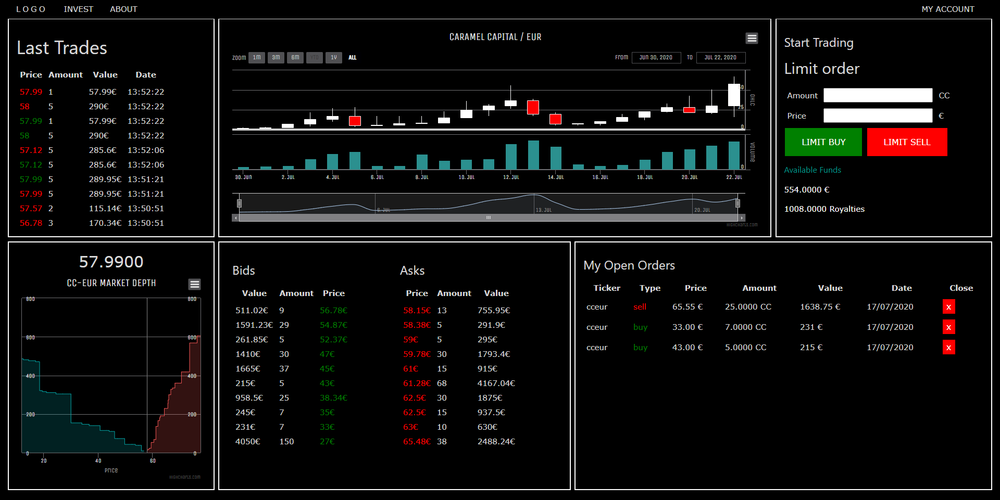
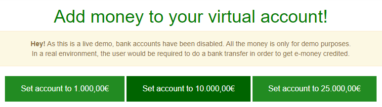

# Caramel Trading Engine

## Summary
Caramel Trading Engine is a real-time marketplace where you can trade stocks.

   

## Features
- Built-in matching engine.
- Interactive Candlestick Historical Price Graph.
- Interactive Market Depth Graph.
- Create and cancel buy/sell orders.
- Last Trades List.
- My Open Orders List.
- Bids and Asks.
- Account system: Register/Login
- Admin Dashboard (Work in progress).
- [KYC Verification](https://en.wikipedia.org/wiki/Know_your_customer) (Work in progress)

## Contributing
### Fork this repository
Fork this repository by clicking on the fork button on the top of this page. This will create a copy of this repository in your account.
### Clone your fork
Clone your forked repository to your local machine.
### Create or browse an existing issue
Assign yourself to an existing issue or create a new issue so other contributors know what you are working on.
[Issues](https://github.com/pablogalve/Caramel-Trading-Engine/issues)
### Create a branch
Create a branch with a descriptive name on your forked repository.
### Make necessary changes and commit those changes
### Submit your changes for review
Create a Pull Request with your changes. I promise that I'll review it as soon as possible to include it in the main repository!

## View a Demo Live Engine
### Instructions
- Visit our [Live Demo](https://www.pablogalve.com/caramel_capital/invest/equity/market-pro)
- Create an account (Register), or request credentials and we'll provide them for you.
- Visit the 'deposit' section and choose to credit your account with 1000, 10k or 25k EUR

   

- That's all! You can now go to the 'invest' section and start trading!

## License
Check out our [license](license.md)